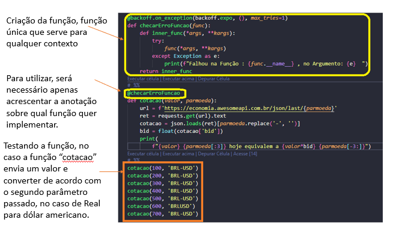
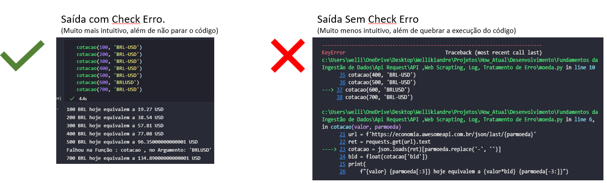
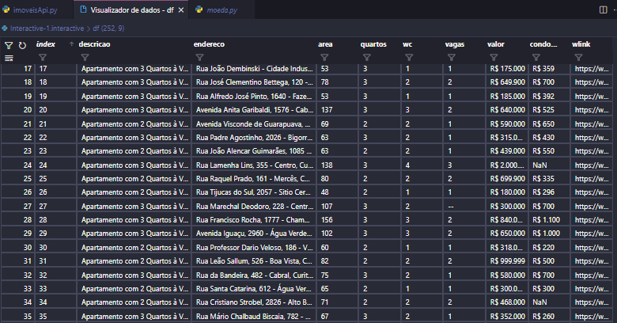
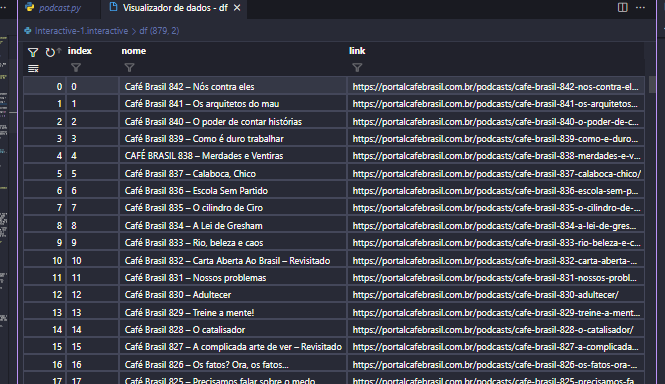

<div align="center" id="top"> 
  <a href="https://www.linkedin.com/in/wellikiandre/">
     
</a>

  &#xa0;

  <!-- <a href="https://www.linkedin.com/in/wellikiandre/">LinkdeIn</a> -->
</div>

<h3 align="center">Projeto Python para : API, Web Scrapting, Log, Tratamento de Erro, Ingestão e Tratamento de Dado</h1>

<p align="center">

<a href="https://www.linkedin.com/in/wellikiandre/">
     
</a>

</p>


<p align="center">
  <a href="#cherries-tratamentodeerro">Tratatamento de Erro + Log</a> &#xa0; | &#xa0; 
  <a href="#wine_glass-api">Api + Web Scrapting + Log</a> &#xa0; | &#xa0;
  <a href="#pizza-web-scrapting">Web Scrapting + log</a> &#xa0; | &#xa0;
  <a href="#white_check_mark-requirements">Requirements</a> &#xa0; | &#xa0;
  <a href="#checkered_flag-starting">Starting</a> &#xa0; | &#xa0;
  <a href="#memo-license">License</a> &#xa0; | &#xa0;
</p>
</br>

<h5>&nbsp&nbsp&nbsp Neste projeto você encontrará 3 arquivos com a extensão .py onde cada código python possui uma finalidade diferente dentro da engenharia de dados, ambos projetos usando controle de log e usando boas práticas de desenvolvimento de código.
Todos os dados são exportável para .csv</h5>

</br>

## :white_check_mark: Requirements ##

Tenha certeza de tenha instalado [Git](https://git-scm.com) e [Python](https://www.python.org/) , seguir a etapa Starting.

## :checkered_flag: Starting ##

```bash
# Clone this project
$ git clone https://github.com/Wellikiandre/Python-IApi-Log-Tratamento-de-Erro-Web-Scrapting-.git


# Install dependencies
$ pip install -r requirements.txt

```

## :memo: License ##
Made with :heart: by <a href="https://www.linkedin.com/in/wellikiandre/" target="_blank">{{Wee Wellikiandre}}</a>
&#xa0;
</br>

## :cherries: TratamentoDeErro ##

###### Arquivo: Moeda.py
<p>   
  <ul>
    <li> Neste código você vai encontrar uma função chamada "checarErroFuncao" onde a mesma pode ser usada como anotação em cima de qualquer outra função, classe dentro do seu código. Sua função principal e melhorar na identificação da do erro/falha de forma muito mais intuitiva conforme foto abaixo.
Neste Exemplo foi passado através da função "cotacao(600, 'BRLUSD')" o valor de conversão de 600 reis para dólar americano. Como podemos ver abaixo é muito mais simples identificar o erro, no casso abaixo podemos observar o nome da função com erro e qual parâmetro está errado. </li>
<li>Implementação </br>
   
</li>
<li>Resultado </br>
   
</li>
  </ul>
</p>


## :wine_glass: Api ## 

###### Arquivo: imoveisApi.py
<p>   
  <ul>
    <li> Este projeto tem a finalidade de raspas os dados do site Viva real capturando os dados imóveis trazendo a localização, valor, quantidade de quartos quantidade banheiros, quantidade de garangens, ou seja, todos os dados do anúncio .</li>
  <li>Projeto usando pyhon e as bibliotecas [requests, BeautifulSoup e pandas], exemplo resultado final. </br>
     
  </li>
</ul>
</p>


## :pizza: Web Scrapting ## 

###### Arquivo: podcast.py
<p>   
  <ul>
    <li> Este projeto tem a finalidade de raspas os dados do site café Brasil capturando os dados dos podcaste e seus link de acesso gerando uma bibliotecxa de acesso. </li>
  <li>Projeto usando pyhon e as bibliotecas [requests, BeautifulSoup, logging e pandas], exemplo resultado final. </br>
     
  </li>
</ul>
</p>


